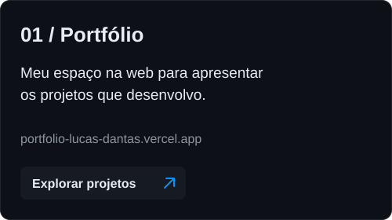
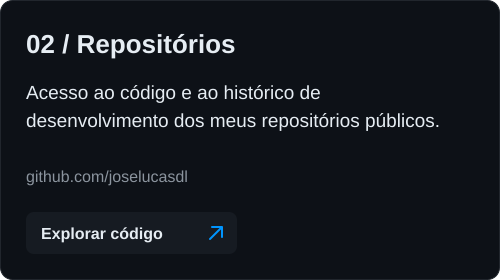

<!-- Perfil: joselucasdl | Paleta: #0095FF · #0D1117 · #C9D1D9 -->

  

  

  <a href="https://portfolio-lucas-dantas.vercel.app/">Portfólio ↗</a>
  &nbsp;&nbsp;·&nbsp;&nbsp;
  <a href="https://github.com/joselucasdl?tab=repositories">Repositórios ↗</a>
  &nbsp;&nbsp;·&nbsp;&nbsp;
  <a href="https://www.linkedin.com/in/joselucasdl/">LinkedIn ↗</a>

 

## Sobre mim

Sou **José Lucas Dantas de Lima**, desenvolvedor **Full-Stack Júnior**. Trabalho com JavaScript e TypeScript no desenvolvimento web, do front-end com React e Next.js ao back-end com Node.js.

Minha stack também inclui HTML, CSS e Tailwind CSS para as interfaces, além de MySQL, Prisma ORM e APIs REST para a parte de dados e integração.

Você encontra meus projetos no [portfólio](https://portfolio-lucas-dantas.vercel.app/) e meu código público aqui no GitHub.

 

## Tecnologias

**Interface**

  

**Linguagens, back-end e dados**

  

  

 

## Projetos & código

  
  

<!-- Os cards apontam para os destinos informados, sem presumir projetos específicos. -->

 

## GitHub em números

  
  

  

  Top Languages reflete o código analisado nos repositórios públicos, não o nível de domínio de cada tecnologia.

 

### Atividade recente

  

  
<b>GitHub Trophies</b>

   
  

    
  

 

### Contribuições em movimento

<picture>
  <source media="(prefers-color-scheme: dark)" srcset="https://raw.githubusercontent.com/joselucasdl/joselucasdl/output/github-snake-dark.svg" />
  <source media="(prefers-color-scheme: light)" srcset="https://raw.githubusercontent.com/joselucasdl/joselucasdl/output/github-snake.svg" />
  
</picture>

 

## Vamos conversar

  
  &nbsp;
  
  &nbsp;
  

 

  

  <b>José Lucas Dantas de Lima</b> &nbsp; / &nbsp; @joselucasdl
   
  Interface. Código. Conexões.

<!--
CONFIGURAÇÃO DO PERFIL

1. Crie um repositório público chamado joselucasdl na conta joselucasdl.
2. Salve este conteúdo como README.md na raiz desse repositório.
3. Os serviços externos geram os cards dinamicamente e podem apresentar indisponibilidade.
4. Para ativar a Snake, crie .github/workflows/snake.yml na branch padrão.
5. Copie apenas o YAML abaixo para esse arquivo, sem este comentário HTML.
6. Depois do commit, abra Actions, selecione "Atualizar Snake" e clique em Run workflow.
7. Após a primeira execução bem-sucedida, os SVGs estarão na branch output e aparecerão aqui.

O YAML precisa existir em um arquivo separado: deixá-lo neste comentário não executa a Action.
O GITHUB_TOKEN já é fornecido pelo GitHub Actions. Não cole tokens pessoais no README.

name: Atualizar Snake

on:
  schedule:
    - cron: '23 3 * * *'
  workflow_dispatch:

permissions:
  contents: write

concurrency:
  group: profile-snake
  cancel-in-progress: false

jobs:
  atualizar:
    runs-on: ubuntu-latest
    timeout-minutes: 10
    steps:
      - name: Gerar animações das contribuições
        uses: Platane/snk/svg-only@v3
        with:
          github_user_name: joselucasdl
          outputs: |
            dist/github-snake.svg?color_snake=#0095FF&color_dots=#EBEDF0,#B8DFFF,#75BFFF,#339EFF,#0075CC
            dist/github-snake-dark.svg?palette=github-dark&color_snake=#0095FF&color_dots=#161B22,#0A3352,#07598A,#007AC2,#0095FF
        env:
          GITHUB_TOKEN: ${{ secrets.GITHUB_TOKEN }}

      - name: Publicar SVGs na branch output
        uses: peaceiris/actions-gh-pages@v4
        with:
          github_token: ${{ secrets.GITHUB_TOKEN }}
          publish_branch: output
          publish_dir: ./dist
          keep_files: true
          commit_message: Atualizar animações de contribuições

-->
